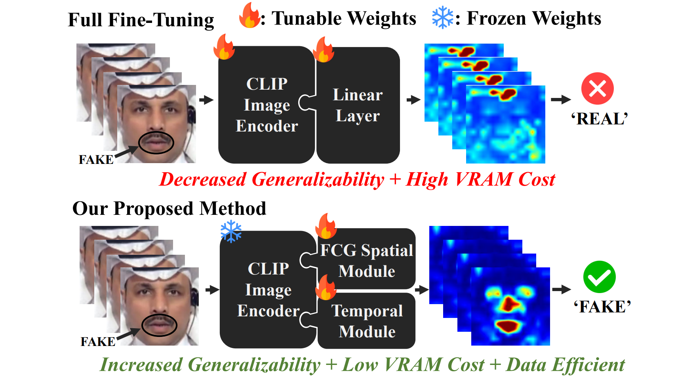

<p align="center">
  <h1 align="center">[CVPR'25] Towards More General Video-based Deepfake Detection through Facial Feature Guided Adaptation for Foundation Model (DFD-FCG)</h1>

  <p align="center">
    <a href="https://github.com/ODD2"><strong>Yue-Hua Han</strong></a>
    <!-- <sup>1,3,4</sup> -->
    &nbsp;&nbsp;
    <a href="https://github.com/Teddy12155555"><strong>Tai-Ming Huang</strong></a>
    <!-- <sup>1,3,4</sup> -->
    &nbsp;&nbsp;
    <a href="https://scholar.google.com/citations?user=nnzQtDAAAAAJ&hl=zh-TW"><strong>Kai-Lung Hua</strong></a>
    <!-- <sup>2,4</sup> -->
    &nbsp;&nbsp;
    <a href="https://scholar.google.com.au/citations?user=3x9KITUAAAAJ&hl=en"><strong> Jun-Cheng Chen</strong></a>
    <!-- <sup>1✉</sup> -->
    <br>
    <br>
    <!-- <sup>1</sup>Academia Sinica&nbsp;
    <sup>2</sup>Microsoft&nbsp;
    <sup>3</sup>National Taiwan University&nbsp;
    <br>
    <sup>4</sup>National Taiwan University of Science and Technology&nbsp; -->
    
  </p>
</p>

## 🥇Abstract
<div style="text-align: justify">  
Generative models have enabled the creation of highly realistic facial-synthetic images, raising significant concerns due to their potential for misuse. While research in Deepfake detection has advanced rapidly, many methods still struggle to generalize to unseen Deepfakes generated by novel synthesis techniques. To address this challenge, we propose a novel side-network-based decoder that extracts spatial and temporal cues based on the CLIP image encoder for generalized video-based Deepfake detection. Additionally, we introduce the Facial Component Guidance (FCG) to enhance the spatial learning generalizability by encouraging the model to focus on key facial regions. The cross-dataset evaluation demonstrates the superior performance of our approach, surpassing state-of-the-art methods on challenging datasets. Extensive experiments further validate the effectiveness of the proposed method in terms of data efficiency, parameter efficiency and model robustness.
</div>

## 📝TODOs
  - [ ] Project Website
  - [ ] Model Weights + Inference Code
  - [ ] Paper Link
  - [ ] Training Code

## 🔗BibTeX
If you find our efforts helpful, please cite our paper and leave a star for further updates!
```bibtex
@inproceedings{cvpr25_dfd_fcg,
      title={Towards More General Video-based Deepfake Detection through Facial Feature Guided Adaptation for Foundation Model},
      author={Yue-Hua Han, Tai-Ming Huang, Kai-Lung Hua, Jun-Cheng Chen},
      booktitle={Proceedings of the Conference on Computer Vision and Pattern Recognition (CVPR)},
      year={2025}
}
```


## 📭 Contact
If you have any comments or questions, feel free to contact us!
